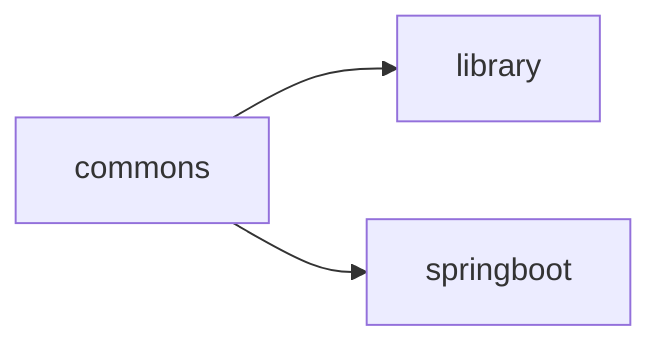

# Gradle subprojects example

This repository demonstrates a modern Gradle approach to work with subprojects.

**I believe that modern Gradle is only kts**

**Also, I believe that modern JVM language is Kotlin, not Java**

## Shared build logic

You can easily share plugins and their configuration between subprojects using configurations conventions. After 
creating you can use conventions as plugins.

1. create the directory `buildSrc` in the root of project;
2. create the directory `buildSrc/src/main/kotlin`;
3. Create file `buildSrc/build.gradle.kts` with content. 
   ```kotlin
   plugins {
        `kotlin-dsl`
   }
   repositories {
      // gradlePluginPortal()  may be required when you want to add another plugins
      mavenCentral()
   }
   ```

It's minimal compilable project that do nothing. Will add conventions with Kotlin support.

1. Add kotlin gradle plugin as dependency in the `buildSrc/build.gradle.kts`. Note that you should
   use full artifact's coordinates. It's different from declare plugin in the `plugins` section where you reference to
   a plugin only by an id. Use https://mvnrepository.com/ to find coordinates by the plugin's id.
   ```kotlin
   dependencies {
       implementation("org.jetbrains.kotlin.jvm:org.jetbrains.kotlin.jvm.gradle.plugin:$kotlinVersion")
   }
   ```
   
2. Create the file `buildSrc/src/main/kotlin/example.commons.gradle.kts`. It's conventions, and you can configure it like 
normal build script:
   ```kotlin
   import org.jetbrains.kotlin.gradle.dsl.JvmTarget

   plugins {
   id("org.jetbrains.kotlin.jvm")
   }
   
   repositories {
   mavenCentral()
   }
   
   kotlin {
    jvmToolchain(21)

    compilerOptions {
        freeCompilerArgs.add("-Xjsr305=strict")
        jvmTarget.set(JvmTarget.JVM_21)
    }
   }
   ```

3. Now you use convention as plugin in the subproject `subproject-a/build.gradle.kts`:
   ```kotlin
   plugins {
     id("example.library")
   }
   ```

You also use one convention in another, see [example.library.gradle.kts](buildSrc/src/main/kotlin/example.library.gradle.kts) and
[example.springboot.gradle.kts](buildSrc/src/main/kotlin/example.springboot.gradle.kts). 


## One version of dependency
Version catalogs allows to declare and share dependencies with versions between subprojects:
https://docs.gradle.org/current/userguide/platforms.html#sub:version-catalog

How to:

1. Add version catalog into root `settings.gradle.kts` ([example](settings.gradle.kts#L11))
2. Reference in subprojects using `implementation(rootProject.libs.bundles.logging)`. Take attention on
   `rootProject` ([example]())

Instead of using kts you may prefer use [TOML](https://toml.io/en/) to define versions catalog. 
Read a [documentation](https://docs.gradle.org/current/userguide/platforms.html#sub::toml-dependencies-format) to know more.


> [!WARNING]
> I recommend to reload Gradle scripts after adding dependencies into version catalog if you use 
> IntelliJ IDEA. Without it IDE indicates error on `rootProjects.libs.bundles.logging`.

> [!TIP]
> You can use groups of dependencies. See `logging` bundle in example which adds two dependencies.

## Java (Kotlin) toolchain
If you build Java/Kotlin/Scala/... application with Gradle application usually 2 JVM is executed:
* First run Gradle itself
* Second runs Gradle tasks (compile code, run test, etc.)

It is very inconvenient when you have one version of JDK on your car, and you need another to build. Java (Kotlin)
can solve this problem with jvm toolchain ([documentation](https://docs.gradle.org/current/userguide/toolchains.html)).
You can build application with JDK 21 even if you have only JDK 11 installed in you environment. Gradle download required
JVM if can't find it locally.

You can enable Java and Kotlin jvm toolchain in Kotlin project in `build.gradle.kts` [documentation](https://kotlinlang.org/docs/gradle-configure-project.html#gradle-java-toolchains-support):
```kotlin
kotlin {
   jvmToolchain(21)
}
```

Java project:
```kotlin
java {
    toolchain {
        languageVersion = JavaLanguageVersion.of(17)
    }
}
```
 